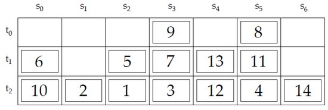

# 基于特征融合的容器调度优化研究
# Optimizing Container Scheduling based on Feature Fusion

> to be constructed

A repository for my graduation thesis, built to store codes and other important files.

## Background
- 集装箱（container）码头在国际货运物流链中发挥着重要作用，它提供了一个集装箱的临时储存场所。通过船只、卡车或火车运到集装箱码头的集装箱被储存在集装箱堆场，它们被竖直成层（tiers）堆放，形成几个堆垛（stacks），这样的的区域称为贝（bay）。

- **Block relocation problem（BRP，or container relocation problem），是为了找到一个最佳的操作顺序来按照给定的顺序从集装箱堆场取出block。问题的数学本质是组合优化问题，从精确解的时间复杂度分析属于NP-hard问题。**

  

- 如图所示，需要先取1号，再取2号，以此类推到全部取出。如果要把1号取出来，就先要把5号挪走。这时可以把5挪到2的上面（很笨的办法，因为等会挪2还要再挪一次5），或者6的上面（比较好的方法，因为5，6，10按顺序排列，后面不会出现盖住的问题），所以必然有一个优化的挪箱子的步骤，可以最小化挪动箱子的数量。

- 问题的基本特点有：

  （1）问题的解与列（堆垛）顺序无关；

  （2）根据优先级是否允许赋值相同可分为两种方式：异优先级（笔者译，with distinct priorities）BRP、群优先级（笔者译，with duplicate priorities，or group priorities）BRP；

  （3）根据重定位起点是否受限于待取列可分为两种方式：有限制（restricted）BRP（RBRP）、无限制（unrestricted）BRP（UBRP）；

  （4）重定位次数下界表示某一贝状态还至少需要几次重定位以完成任务，可以用来衡量状态对于问题求解的优劣程度。Lower Bound by Kim and Hong（LB1）直接用阻塞块（笔者译，blocking blocks，这些块阻塞了下层优先级更高的块）的个数估计该界，是比较简单实用的方法。

  （5）精确解是多项式时间不可解的，所以急需一个基于AI的特征抽取器，能够抽取这样问题的特征来寻求最优解。

- 本研究针对有限制异优先级BRP问题，基于对比学习和强化学习快速得到近似解。
